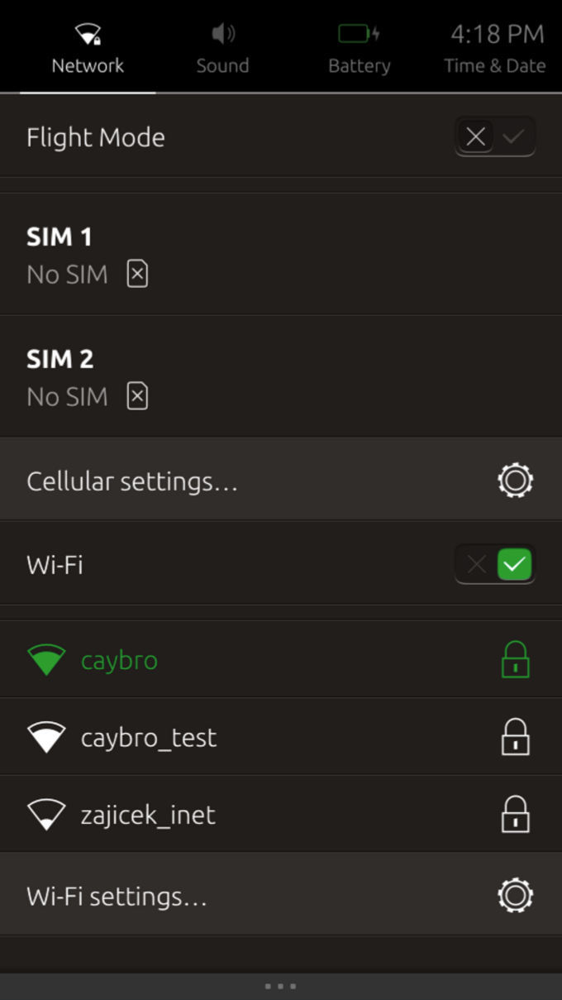

# Network management indicator for Unity 8

A Unity 8 "indicator" to let you see and change basic network setup. This project contains the daemon responsible for building the logical menu structure of the indicator. It talks to [Network Manager](https://wiki.gnome.org/Projects/NetworkManager), [Ofono](https://01.org/ofono), and [URFKill](https://www.freedesktop.org/wiki/Software/urfkill/) (and a few other DBus services) to achieve this.

